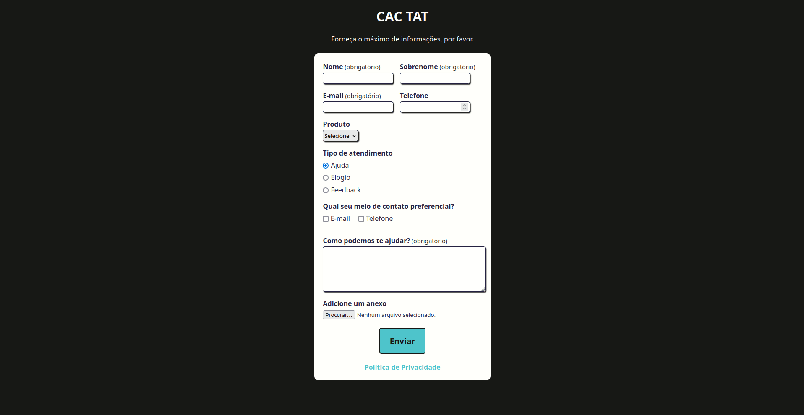

# Testes automatizados da aplicação CAT TAT

👋 Bem-vindo(a) ao repositório de testes automatizados da CAT TAT!

Este repositório é dedicado ao desenvolvimento e execução de testes automatizados para diversos cenários do formulário de atendimento ao cliente da aplicação CAT TAT, utilizando o Cypress como nossa principal ferramenta de testes. Este projeto é parte prática do curso "Cypress Básico" ministrado por Walmyr Filho.

Aqui você encontrará informações sobre como contribuir para o projeto, clonando e configurando o ambiente de testes em sua própria máquina.

## 🚧 Status do Projeto

🚧 **Projeto de automação em desenvolvimento** 🚧

## 🛠 Funcionalidades do Projeto

- **Formulário de atendimento ao cliente:**
  - Nome e Sobrenome
  - E-mail
  - Telefone
  - Produto
  - Tipo de atendimento
  - Preferência de atendimento
  - Campo de texto para detalhes adicionais
  - Opção de anexar arquivos

- **Política de privacidade**

## 📖 Como configurar e rodar o projeto

### Pré-requisitos

Antes de iniciar, certifique-se de que seu computador tenha os seguintes programas instalados:
- **Node.js**
  - Versão utilizada: 18.9.1
- **npm**
  - Versão utilizada: 9.2.0

### 💻 Instalação

Clone este repositório usando o comando:

`git clone <url-do-repositorio>`

Em seguida, navegue até o diretório do projeto e instale as dependências:

`npm install`

### 🚀 Executando os Testes

Para rodar os testes, você tem algumas opções:
- Para execução em modo headless (terminal):
`npm test`
- Para abrir o ambiente interativo do Cypress e executar os testes em um navegador:
`npm run:cy:open`

Explore as funcionalidades do Cypress e contribua para a melhoria contínua do nosso projeto. Agradecemos por seu interesse e contribuição!